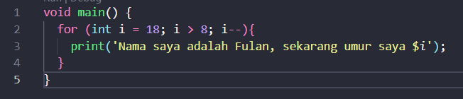
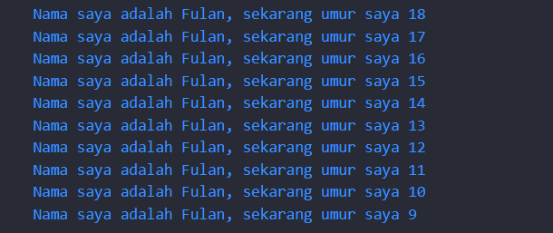

```
Nama : Dhoriffito Diansyah Putra
NIM : 2141720201
Nama Proyek : Variabel dan Tipe Data
```

Jawaban Soal

```
1. Kode Program 
```


```
Output
```


```
2. Mengapa sangat penting untuk memahami bahasa pemrograman Dart sebelum kita menggunakan framework Flutter ? Jelaskan!

Jawaban : Karena basis dari framework flutter merupakan bahasa pemrograman dart, jadi kita harus memahami terlebih dahulu untuk bisa mengaplikasikannya pada framework flutter nantinya
```

```
3. Rangkumlah materi dari codelab ini menjadi poin-poin penting yang dapat Anda gunakan untuk membantu proses pengembangan aplikasi mobile menggunakan framework Flutter.

Jawaban : 
```
```
a. Pengenalan dart
Dart adalah bahasa yang digunakan dalam Flutter, framework untuk membuat aplikasi mobile yang hebat. Untuk mengembangkan dengan Flutter, penting untuk tahu mengapa Dart dipilih, apa kelebihannya, dan asal-usulnya.
```

```
b. Evolusi dart
Dart telah mengalami perkembangan signifikan sejak diluncurkan pada tahun 2011. Awalnya ditargetkan untuk menggantikan JavaScript dalam pengembangan web, Dart sekarang lebih terfokus pada pengembangan mobile melalui framework Flutter. Dart berusaha untuk mengatasi kelemahan JavaScript dengan menawarkan kinerja tinggi, perangkat lunak kuat, alat modern, dan fleksibilitas yang memungkinkan pengembangan proyek berskala besar. Semua ini membuat Dart menjadi bahasa yang luar biasa dan menjadi pilihan inti dalam ekosistem Flutter.
```

```
c. Cara kerja dart

Dart VM (Virtual Machine) yang digunakan untuk menjalankan kode Dart. Ini adalah komponen kunci yang memungkinkan eksekusi program Dart pada berbagai platform. Adapun fitur lain seperti Dart Core Libraries dan Garbage Collector. Dart Core Libraries adalah kumpulan alat dasar yang membantu pengembang dalam tugas-tugas umum seperti matematika dan pengolahan teks, sedangkan Garbage Collectors adalah fitur yang menjaga agar komputer tidak terlalu banyak menggunakan memori dengan membersihkan objek yang tidak lagi digunakan secara otomatis, memudahkan pengelolaan memori dalam program Dart.
```

```
d. Struktur bahasa pemrograman dart
Bahasa dart memiliki kemiripan dengan bahasa-bahasa lainnya yaitu dirancang dengan berbasis object-oriented. Dengan prinsip diatas dart memiliki fitur enkapsulasi, inheritance, compostition, abstraction, dan polimorfisme. Dalam dart terdapat juga operator-operator yang mendukung bahasa dart
```

