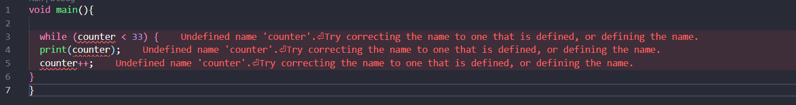

```
Nama : Dhoriffito Diansyah Putra
NIM : 2141720201
Nama Proyek : Perulangan dan Pengkodisian
```

# Praktikum 1

### Langkah 1


### Langkah 2

Pada kode di atas terdapat sebuah string yang berisi test2, kemudian dilakukan pengecekan menggunakan if, else-if, else. Hasilnya akan dilakukakan pengecekan mana yang sesuai dengan value dari variabel test. Kemudian dibawah terdapat pengecekan kembali hanya saja dicek menggunakan if saja

### Langkah 3


1. yang terjadi adalah error karena variabel test sudah digunakan sebelumnya jadi kita harus menggantinya dengan variabel baru yaitu test2
2. error yang ke-2 adalah kerena pengecekan pada if, kerena nilai pada variabel test2 bernilai String jadi harus dibandingkan dengan String juga


#### Berikut Hasil perbaikan kodenya 


# Praktikum 2

### Langkah 1



### Langkah 2

Kode diatas terdapat error karena variabel counter tidak diinisialisasi sebelumnya maka jika dipanggil akan menghasilkan error, maka setelah diperbaiki akan sebagai berikut : 


### Langkah 3


Hal tersebut bisa terjadi error dikarenakan variabel counter belum diinisialisasikan sebelumnya, berikut kode jika sudah diperbaiki : 


# Praktikum 3

### Langkah 1


### Langkah 2

Setelah di eksekusi terdapat error, hal yang menyebabkan error karena variabel `Index` belum diinisialisasikan kemudia belum diberikan increment pada perulangan tersebut. Berikut kode setelah diperbaiki : 


### Langkah 3


Kode di atas tidak terjadi error, tetapi tidak menghasilkan keluaran apapun. Hal tersebut dikarenakan `else if (index > 1 || index < 7)` kode tersebut kondisinya akan selalu terpenuhi sehingga tidak memberikan keluaran apapun. Perbaikannya adalah dengan mengganti `||` dengan menggunakan `&&`. Agar kode dapat melakukan continue hanya pada saat index lebih dari 1 dan index kurang dari 7 . Berikut perbaikan kodenya : 


# Tugas

Kode : 

```
void main() {
  for (int i = 0; i <= 201; i++) {
    // jika ganjil maka print nama dan nim
    if (isPrime(i)) {
      print("Dhoriffito Diansyah Putra / 2141720201");
      // jika salah maka print bilangan tersebut
    } else {
      print(i);
    }
  }
}

// memeriksa apakah suatu bilangan prima atau tidak
bool isPrime(int num) {
  if (num <= 1) {
    return false;
  }
  
  for (int j = 2; j <= num / 2; j++) {
    if (num % j == 0) {
      return false;
    }
  }

  return true;
}
```

Penjelasan kode diatas : kita membuat looping dengan nilai awal 0 dengan batas kurang lebih 201, kemudian dilakukan pengecekan jika prima maka akan keluar nama dan nim sedangkan jika tidak prima maka akan keluar angka. Untuk pengecekannya sendiri menggunakan kode berikut 

```
bool isPrime(int num) {
  if (num <= 1) {
    return false;
  }
  
  for (int j = 2; j <= num / 2; j++) {
    if (num % j == 0) {
      return false;
    }
  }

  return true;
}
```


# Tugas Switch Case

### Kasus Pertama


Penjelasan : Mengapa bisa output menjadi 3, karena pada switch case diatas pembandingnya bertipe String sedangkan variabel a bertipe integer. Maka akan langsung mengarah ke default sehingga `1 + 2 = 3`

### Kasus Kedua


Penjelasan : Karena pembandingnya diubah menjadi integer maka akan langsung keluar pada case 2. Mengapa tidak pada case 1, karena case diatas tidak mempunyai break di dalamnya sedangkan pada case 2 langsung print dan break. Sehingga case-case berikutnya tidak akan dijalankan

