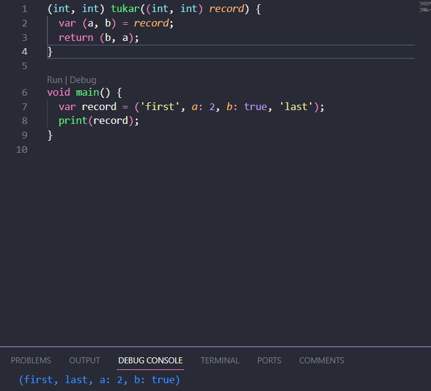

```
Nama : Dhoriffito Diansyah Putra
NIM : 2141720201
Nama Proyek : Eksperimen Tipe Data List
```

# Praktikum 1

## Langkah 1


## Langkah 2

Mengapa mendapat output seperti itu, hal tersebut dikarenakan pada line 8 diubah nilainya menjadi 1. Maka keluarannya akan 1 pada indeks ke-1

## Langkah 3


digunakan untuk mengilustrasikan cara membuat, menginisialisasi, dan mengisi elemen-elemen dalam sebuah List dengan tipe data String?, yang memungkinkan adanya nilai String dan nilai null di dalamnya.

# Praktikum 2

## Langkah 1


## Langkah 2

Yang terjadi adalah setelah di print akan memunculkan value di dalam var halogens

## Langkah 3


yang terjadi adalah tidak menghasilkan apa-apa di dalam sebuah listnya, solusinya adalah dengan kita menambahkan sebuah value ke dalamnya. Setelah diperbaiki akan seperti berikut: 


# Praktikum 3

## Langkah 1


## Langkah 2

Kode diatas adalah aplkasi dari tipe data Map pada Dart

## Langkah 3


Penjelasan : Tidak ada perbedaan antara kode sebelum ditambah dengan sesudahnya tetapi ada hal yang di replace karena nilai fifth dan 18 terubah, tetaou variabel mhs belum digunakan. Perbaikan kode diatas sebagai berikut :


Sehingga variabel mhs1 dan mhs2 dapat digunakan


# Praktikum 4

## Langkah 1


## Langkah 2

Terjadi error dikarenakan variabel list 1 tidak ada, perbaikannya adalah sebagai berikut : 


Saya mengubah variabel yang berada di print menjadi variabel list saja

## Langkah 3


Terdapat error pada kode diatas dikarenakan tidak bisa menggunakan null value

Berikut perbaikan dan penambahan NIM menggunakan Spread Operators


## Langkah 4


terjadi error dikarenakan promoActive belum di definisikan

saat bernilai true sebagai berikut :


saat bernilai false sebagai berikut :


Hanya muncul Home, Furniture, Plants karena nilai yang bersama if bernilai false sehingga tidak ikut di print

## Langkah 5


Terjadi error karena nilai login belum di inisialisasikan

Jika sudah diperbaiki akan seperti ini

a. Login sebagai 'Manager'


b. Login sebagai 'Staff'


## Langkah 6


Collection For digunakan untuk membuat koleksi (seperti list atau set) dengan menggunakan loop. 

# Praktikum 5

## Langkah 1


## Langkah 2

Elemen pertama adalah string 'first'.
Elemen kedua adalah sebuah key-value pair dengan key a dan value 2.
Elemen ketiga adalah sebuah key-value pair dengan key b dan value true.
Elemen keempat adalah string 'last'.

## Langkah 3



Tidak ada perubahan dengan kode sebelumnya, kita coba menggunakan fungsi tukar di dalam main


## Langkah 4


Terjadi error dikarenakan variabel mahasiswa belum di assign


## Langkah 5


Tidak terjadi error dalam kode di atas, jika diubah menjadi salah satu record yang berisi nama dan nim


# Tugas Praktikum

1. Jelaskan yang dimaksud Functions dalam bahasa Dart!
2. Jelaskan jenis-jenis parameter di Functions beserta contoh sintaksnya!
3. Jelaskan maksud Functions sebagai first-class objects beserta contoh sintaknya!
4. Apa itu Anonymous Functions? Jelaskan dan berikan contohnya!
5. Jelaskan perbedaan Lexical scope dan Lexical closures! Berikan contohnya!
6. Jelaskan dengan contoh cara membuat return multiple value di Functions!

## Jawaban Tugas Praktikum ##

1. Function dalam dart berfungsi untuk mengorganisir dan recycle kode program
contoh : 
```
void printHello() {
  print('Hello, World!');
}
```

2. jenis parameter

    a. Named Parameter adalah parameter yang berguna untuk memanggil fungsi dengan menyebutkan nama parameter saat memasukkan argumen ke fungsi tersebut.

    ```
    void printPerson({String? name, int? age}) {
        print('Name: $name, Age: $age');
    }

    void main() {
        // Memanggil fungsi dengan parameter bernama
        printPerson(name: 'John', age: 30);
  
        // Melewatkan hanya parameter yang Anda inginkan
        printPerson(age: 25);
    }

    ```
        

    b. Positional Parameter adalah parameter yang mengatur argumen sesuai urutan posisinya dalam panggilan fungsi.

    ```
    void printPerson(String name, int age) {
        print('Name: $name, Age: $age');
    }

    void main() {
        // Memanggil fungsi dengan parameter posisional
        printPerson('John', 30);
    }

    ```

3. Function tersebut dapat kita simpan di dalam sebuah variabel tertentu, dengan cara mengirimkan sebagai parameter ke dalam function lain, dan dikembalikan dari function lain. 

```
void main() {
  var sayHello = (String name) => print('Hello, $name!');

  sayHello('Android'); // Output: Hello, Android!

  greet('Ios', sayHello); // Output: Hello, Ios!
}

void greet(String name, Function greetFunction) {
  greetFunction(name);
}

```

4. Anonymous functions merupakan sebuah function yang tidak memiliki nama, function ini dapat kita simpan ke dalam sebuah variabel, dengan dikirm sebagai parameter ke dalam function lain. Kemudian dikembalikkan dari function lain.

```
void main() {
  var sayHello = () {
    print('Hello, World!');
  };
  sayHello(); 
}
```

5.  Perbedaan Lexical scope dengan Lexical closure

    a. Lexical scope berkaitan dengan cakupan variabel berdasarkan struktur kode.

    ```
    void main() {
        int x = 10;
  
         void innerFunction() {
            print(x); 
        }
  
        innerFunction();
    }

    ```

    b. Lexical closure merupakan konsep di mana fungsi yang didefinisikan di dalam fungsi lain dapat mengakses variabel dari fungsi luar (lingkup yang lebih tinggi).

    ```
    Function outerFunction() {
        int x = 10;
  
        Function innerFunction = () {
            print(x); 
        };
  
        return innerFunction;
    }

    void main() {
        var closure = outerFunction();
        closure(); 
    }

    ```


