```
Nama : Dhoriffito Diansyah Putra
NIM : 2141720201
Nama Proyek : Flutter Fundamental
```

# Praktikum 1

Membuat Project Flutter Baru

`flutter create week05`  penamaan pada flutter tidak bisa menggunakan simbol jadi setelah dibuat nanti diganti

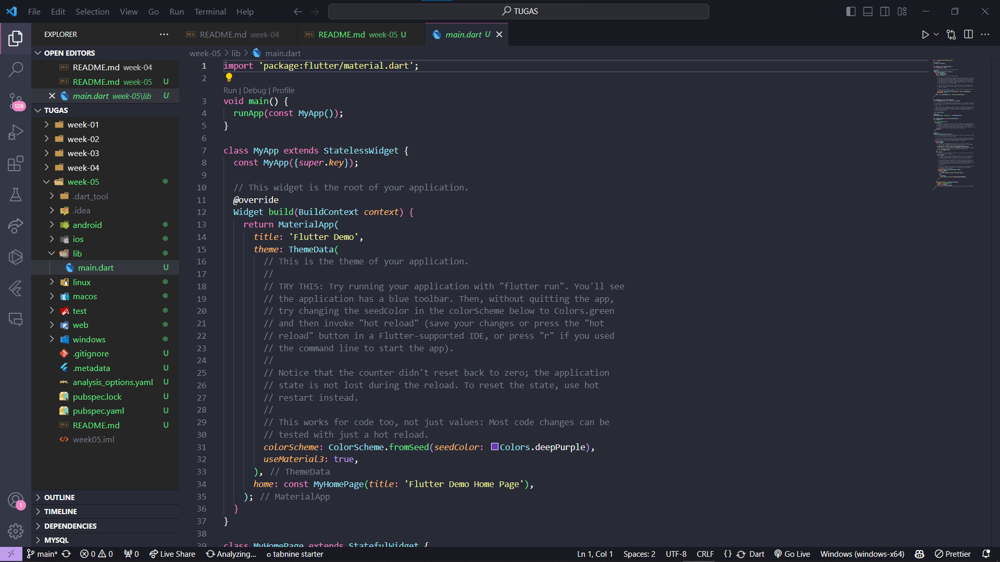

# Praktikum 2

Karena saya sudah membuat repositori di github, jadi langsung ke langkah 11

## Langkah 11

berikut hasilnya : 

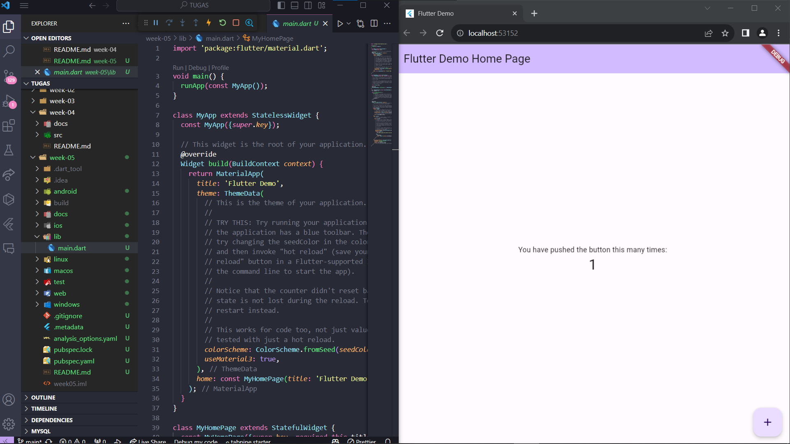

perbaikan kode : 
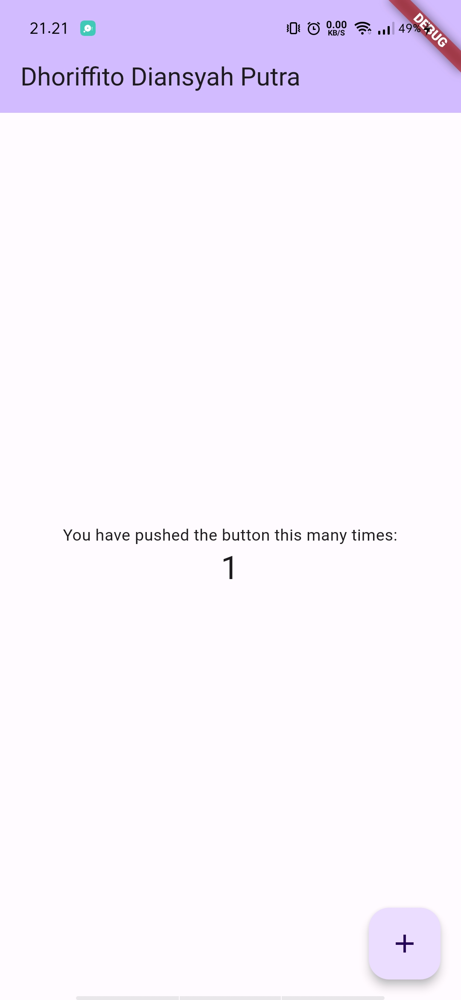

## Langkah 12

Mengganti tulisan default menjadi nama lengkap

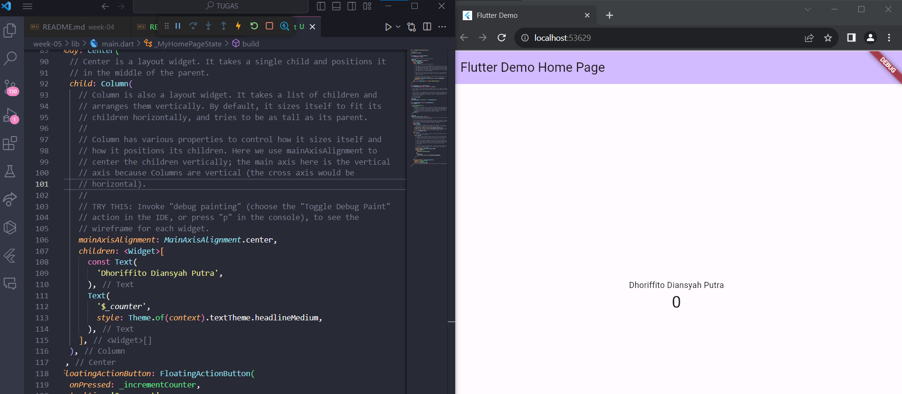

perbaiakan kode :


# Praktikum 3

## Langkah 1

membuat text widget

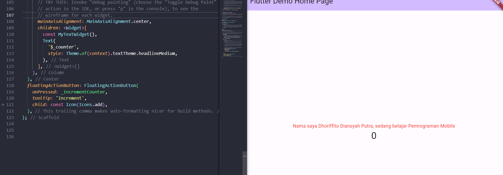

perbaikan kode :
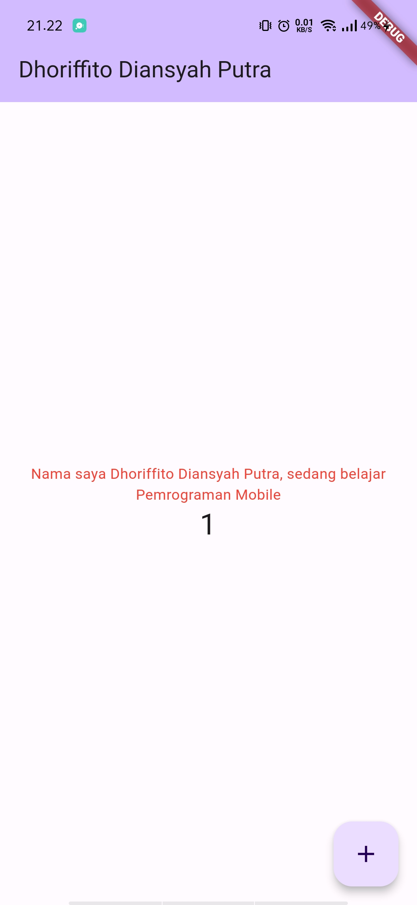

## Langkah 2

membuat image widget

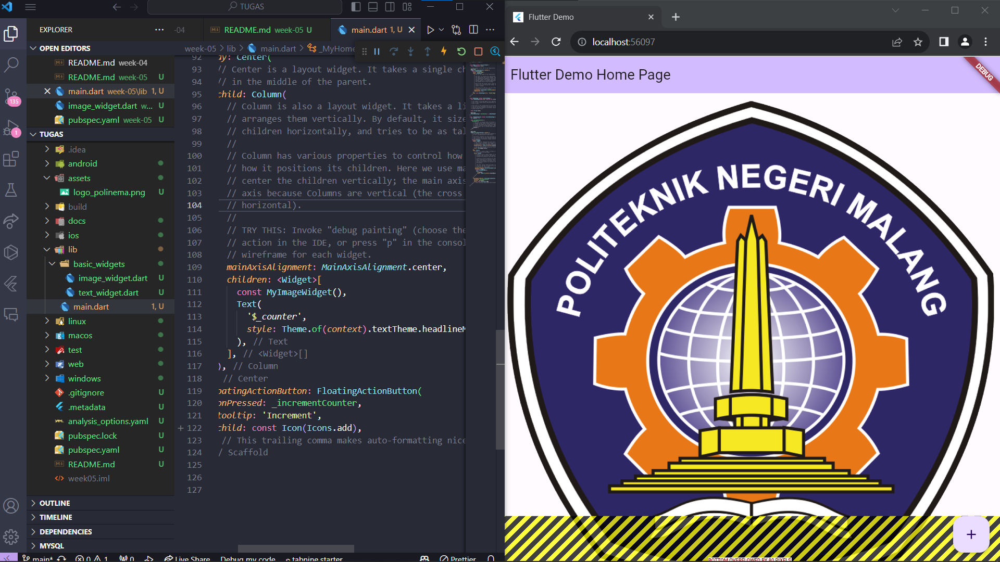

perbaian kode :
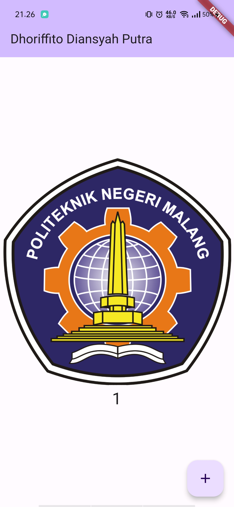

# Praktikum 4

## Langkah 1

### Langkah 1: Cupertino Button dan Loading Bar

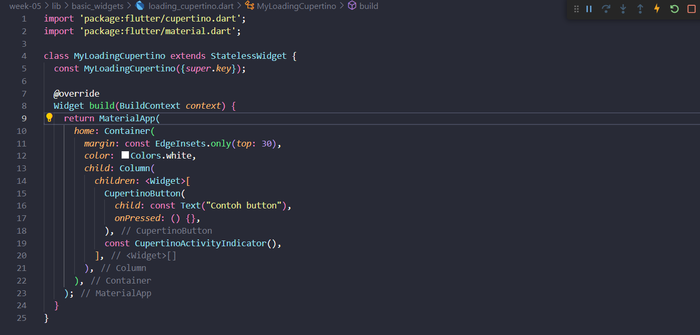

### Langkah 2: Floating Action Button (FAB)

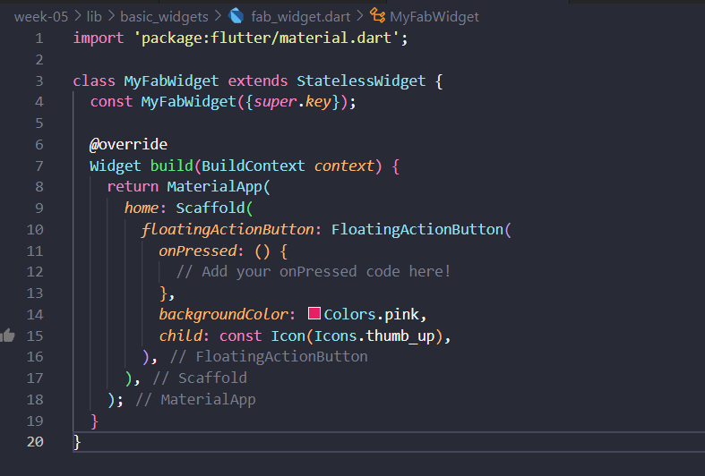

### Langkah 3: Scaffold Widget

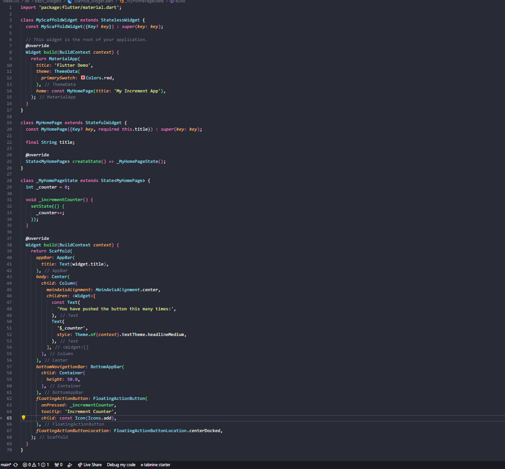

### Langkah 4: Dialog Widget

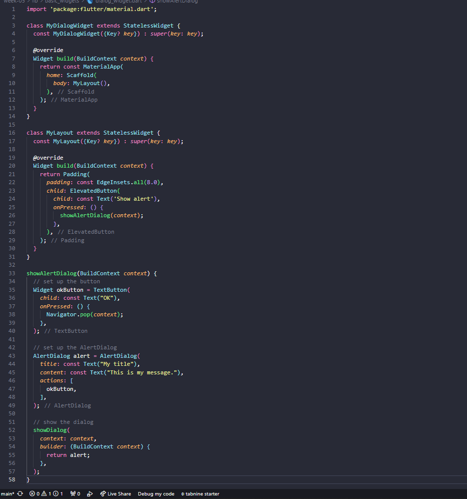

### Langkah 5: Input dan Selection Widget

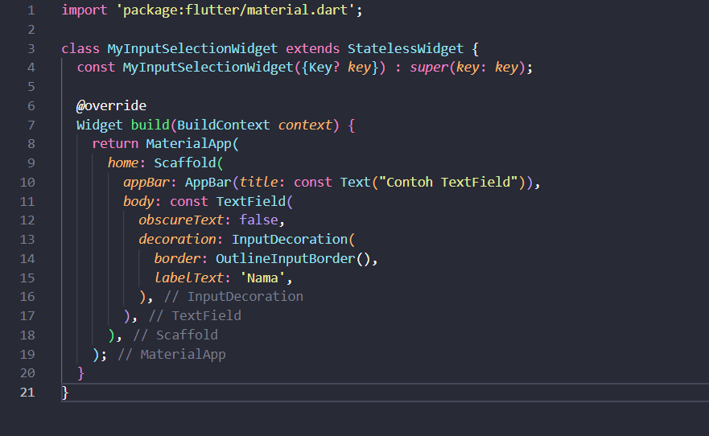

### Langkah 6: Date and Time Pickers

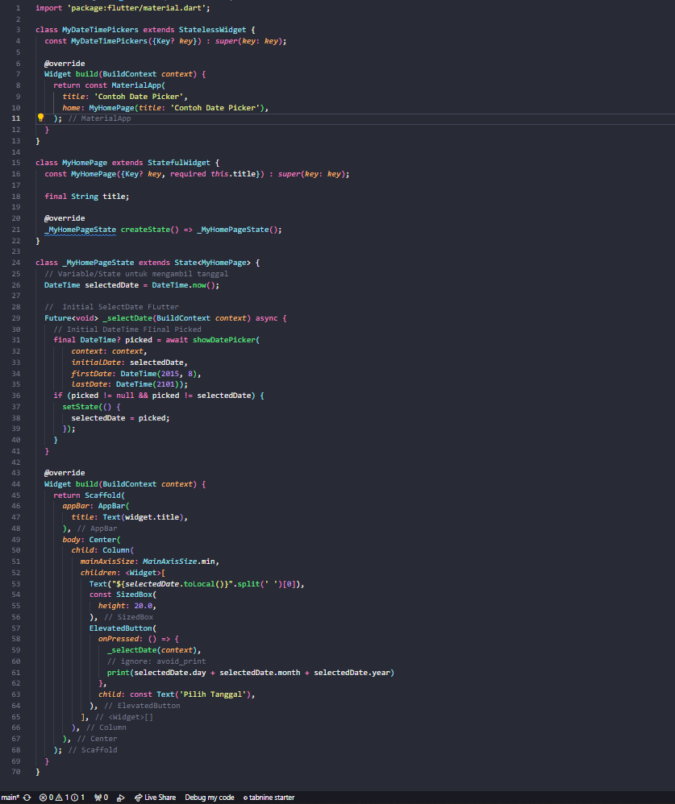


# Tugas Praktikum 

### 1. Selesaikan Praktikum 1 sampai 4, lalu dokumentasikan dan push ke repository Anda berupa screenshot setiap hasil pekerjaan beserta penjelasannya di file README.md!

### 2. Pada praktikum 4 mulai dari Langkah 3 sampai 6, buatlah file widget tersendiri di folder basic_widgets, kemudian pada file main.dart cukup melakukan import widget sesuai masing-masing langkah tersebut!


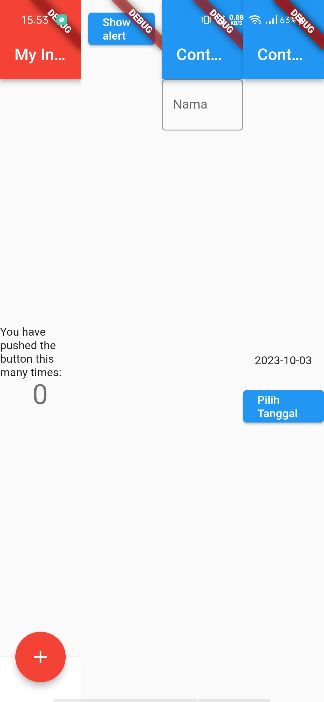

### 3. Selesaikan Codelabs: Your first Flutter app, lalu buatlah laporan praktikumnya dan push ke repository GitHub Anda!

Berikut hasilnya : saya tambahkan ke dalam repositori ini

https://github.com/NasiUduk27/tugas_mobile_namer_app/tree/master/namer_app 

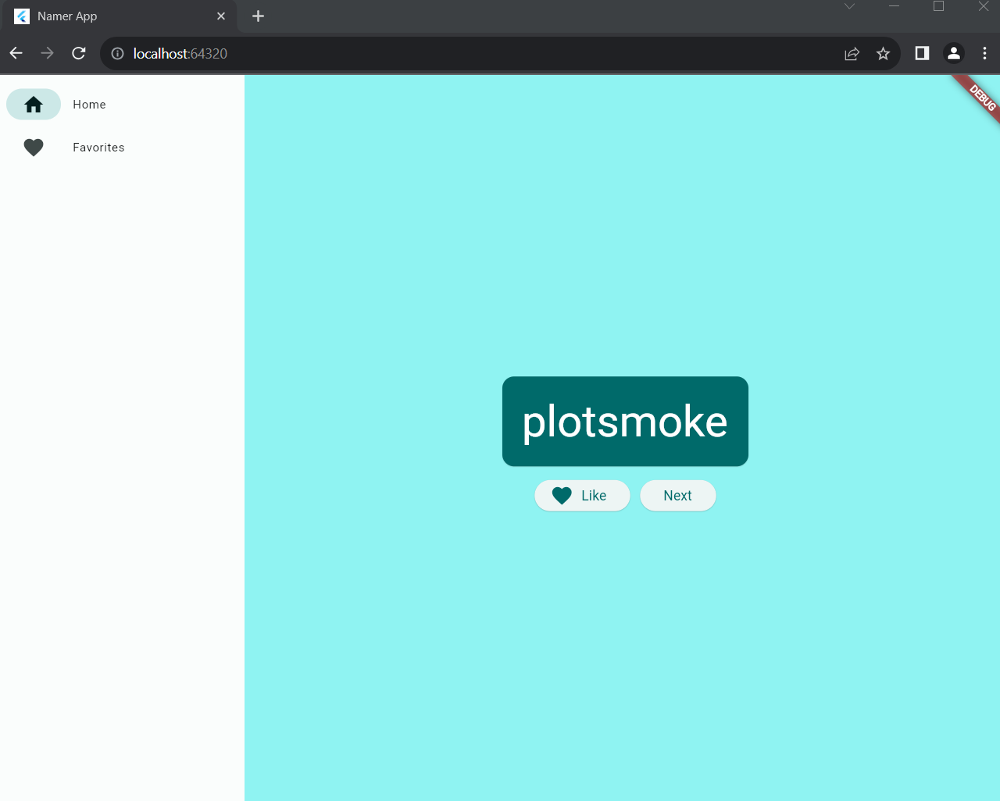


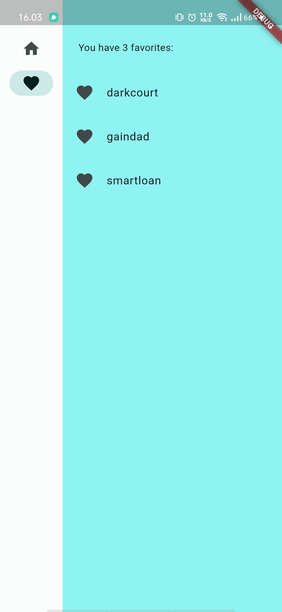

### 4. README.md berisi: capture hasil akhir tiap praktikum (side-by-side, bisa juga berupa file GIF agar terlihat proses perubahan ketika ada aksi dari pengguna) di browser dan perangkat fisik (device) dengan menampilkan NIM dan Nama Anda sebagai ciri pekerjaan Anda. Jika mode developer di perangkat HP Anda belum aktif, silakan cari di internet cara mengaktifkannya!

### 5. Kumpulkan berupa link repository/commit GitHub Anda ke tautan spreadsheet yang telah disepakati oleh dosen!


