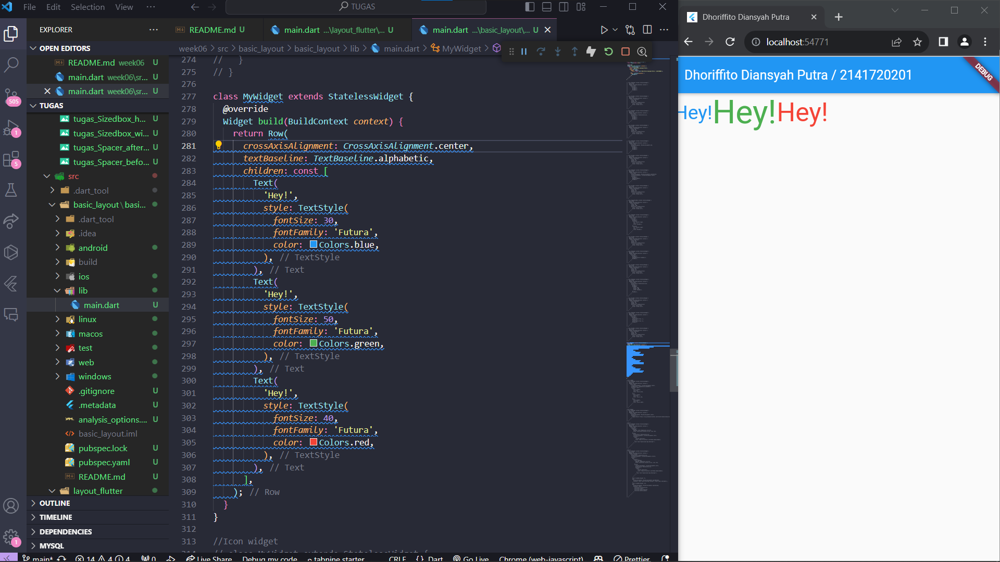

```
Nama : Dhoriffito Diansyah Putra
NIM : 2141720201
Nama Proyek : Flutter Fundamental 2 (Layout dan Navigasi)
```

# Praktikum 1

## Langkah 4 : Implementasi Title Row


# Praktikum 2 : Implementasi button row


# Praktikum 3 : Implementasi text section


# Praktikum 4 : Implementasi image section


# Tugas Praktikum : 

## Row and Column classes

| Row | Column |
| --- | ----------- |
|  | |

## Axis size and alignment

### mainAxisSize

| MainAxisSize.max | MainAxisSize.min |
| --- | ----------- |
|  | |

### mainAxisAlignment

| MainAxisAlignment.start | MainAxisAlignment.end | 
| --- | ----------- |
|  | |

### crossAxisAlignment

| CrossAxisAlignment.start | CrossAxisAlignment.center |
| --- | ----------- |
|  | |

## Flexible widget

| Flexible.loose | Flexible.tight |
| --- | ----------- |
|  | |

## Expanded widget

| Expanded_before | Expanded_after |
| --- | ----------- |
|  | |

## Sizedbox widget

| Sizedbox_width | Sizedbox_height |
| --- | ----------- |
|  | |

## Spacer widget

| Spacer_before | Spacer_after |
| --- | ----------- |
|  | |

## Text widget

| Text_center | Text_baseline |
| --- | ----------- |
|  | |

## Icon widget

| Icon_before | Icon_after |
| --- | ----------- |
|  | |

## Image widget

| Image_1 | Image_2 |
| --- | ----------- |
|  | |

## Putting it all together


