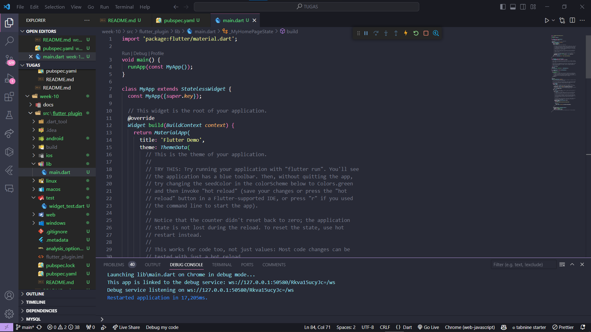
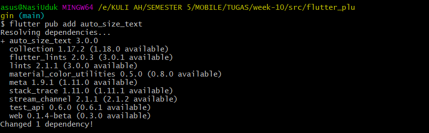
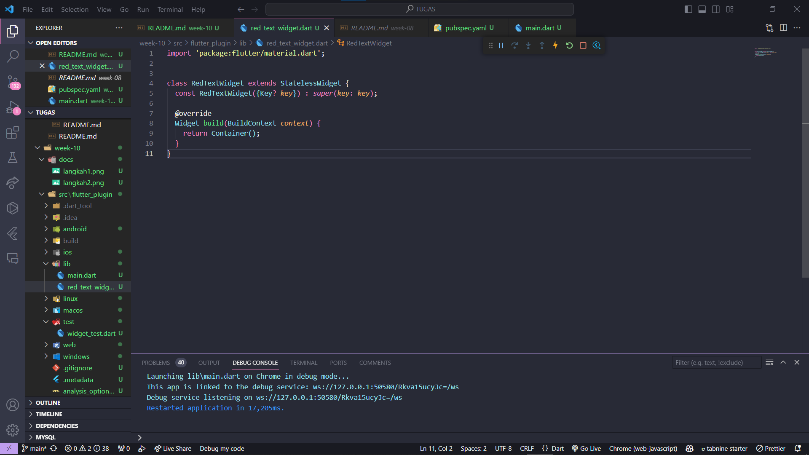
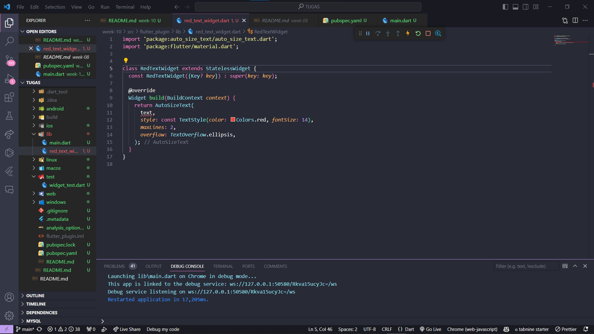
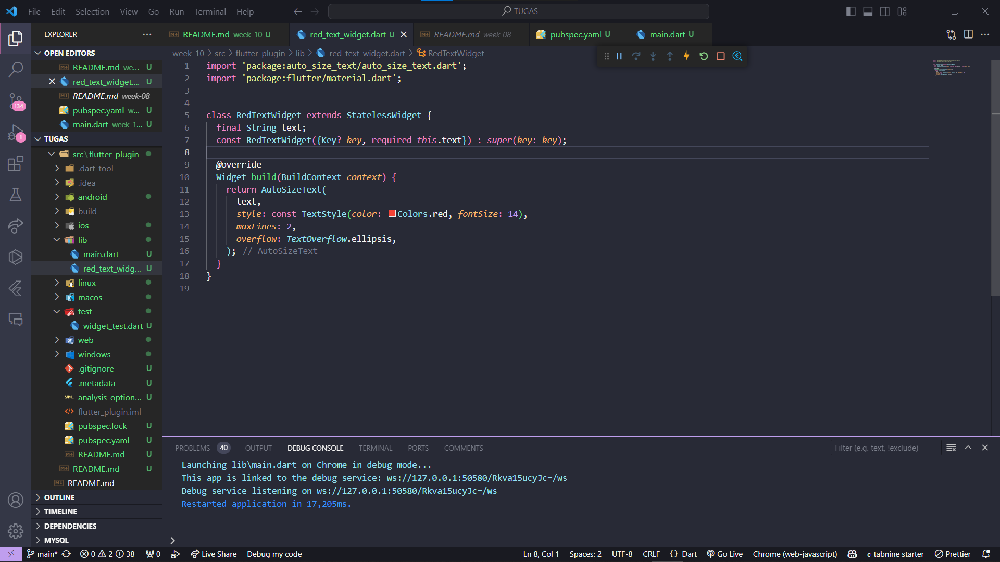
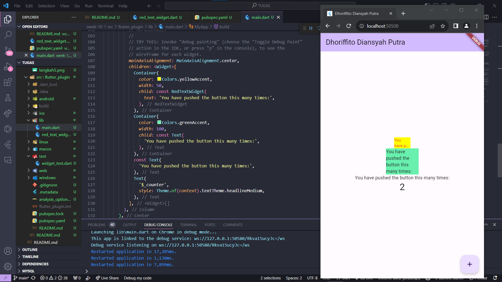

## Langkah 1



## Langkah 2: Menambahkan plugin



## Langkah 3: Buat file red_text_widget.dart



## Langkah 4: Tambah Widget AutoSizeText



## Langkah 5: Buat Variabel text dan parameter di constructor



## Langkah 6: Tambahkan widget di main.dart




# Tugas Praktikum 

## Selesaikan Praktikum tersebut, lalu dokumentasikan dan push ke repository Anda berupa screenshot hasil pekerjaan beserta penjelasannya di file README.md!
 done
## Jelaskan maksud dari langkah 2 pada praktikum tersebut!

Untuk menambah dependency pada pubspec.yaml agar dapat menggunakan plugin auto_size_text. Plugin ini dapat digunakan untuk membuat teks dalam aplikasi Flutter secara otomatis dengan menyesuaikan ukuran berdasarkan kontennya.

## Jelaskan maksud dari langkah 5 pada praktikum tersebut!

kode tersebut digunakan untuk menerima teks yang akan ditampilkan sebagai properti text dan menggunakan constructor untuk inisialisasi. 

## Pada langkah 6 terdapat dua widget yang ditambahkan, jelaskan fungsi dan perbedaannya!

2 Container dengan teks yang berbeda, satu menggunakan widget khusus RedTextWidget dan yang lainnya menggunakan widget Text.

## Jelaskan maksud dari tiap parameter yang ada di dalam plugin auto_size_text berdasarkan tautan pada dokumentasi ini !

```
key: Kontrol bagaimana satu widget menggantikan widget lain di dalam tree.
textKey: Mengatur key untuk widget Text yang dihasilkan.
style: Jika tidak nol, gaya yang akan digunakan untuk teks ini.
minFontSize: Batas ukuran font minimum yang akan digunakan saat menyesuaikan ukuran teks secara otomatis. Diabaikan jika presetFontSizes diatur.
maxFontSize: Batas ukuran font maksimum yang akan digunakan saat menyesuaikan ukuran teks secara otomatis.
stepGranularity: Menentukan berapa banyak ukuran font dikurangi setiap langkah. Biasanya, nilai ini tidak boleh di bawah 1 untuk performa terbaik.
presetFontSizes: Daftar ukuran font yang akan dicoba sebelum menyesuaikan ukuran font secara otomatis. Jika daftar ini disediakan, minFontSize dan maxFontSize diabaikan.
maxLines: Jumlah baris maksimum yang akan ditampilkan. Jika teks lebih panjang dari jumlah baris ini, maka teks akan dipotong atau ditimpa oleh elipsis (...).
overflow: Perilaku teks jika tidak muat di dalam widget. Nilai ini dapat berupa TextOverflow.ellipsis, TextOverflow.visible, atau TextOverflow.clip.
softWrap: Apakah teks akan dibungkus ke baris berikutnya jika tidak muat di dalam widget.
textAlign: Perataan teks horizontal.
textDirection: Arah teks.
locale: Lokal yang akan digunakan untuk memformat teks.

```

## Kumpulkan laporan praktikum Anda berupa link repository GitHub ke spreadsheet yang telah disediakan!

