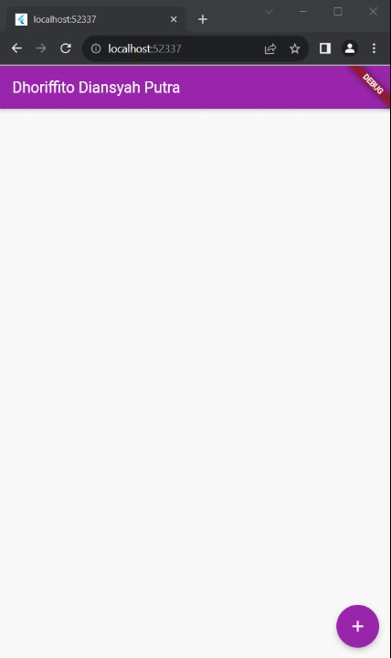
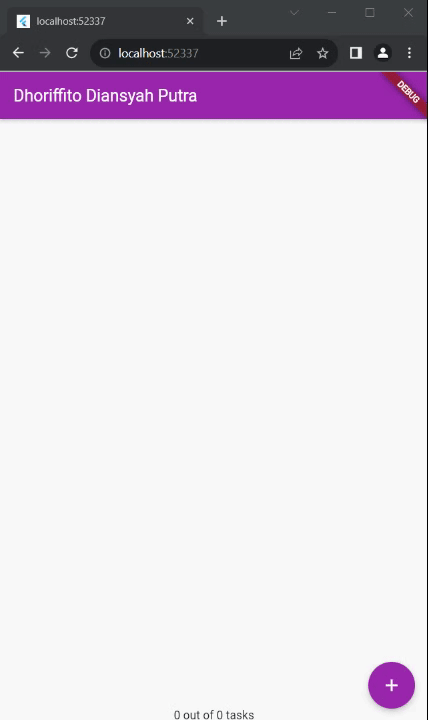
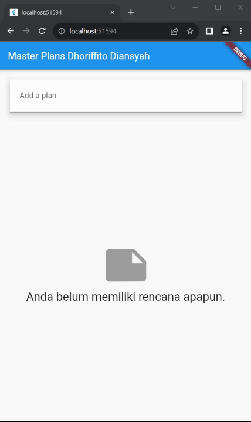

## Nama: Dhoriffito Diansyah Putra
## NIM: 2141720201

## Praktikum 1

### Tugas Praktikum 1

#### 1. Selesaikan langkah-langkah praktikum tersebut, lalu dokumentasikan berupa GIF hasil akhir praktikum beserta penjelasannya di file README.md!
Done
#### 2. Jelaskan maksud dari langkah 4 pada praktikum tersebut! Mengapa dilakukan demikian?
dilakukan seperti itu agar kita tidak usah mengimpor file dari model satu persatu, sehingga kode nya akan lebih ringkas dan efisien
#### 3. Mengapa perlu variabel plan di langkah 6 pada praktikum tersebut? Mengapa dibuat konstanta ?
karena variabel plan akan digunakan untuk menyimpan data yang akan ditampilkan pada widget Text, dan konstanta digunakan agar data yang disimpan tidak dapat diubah
#### 4. Lakukan capture hasil dari Langkah 9 berupa GIF, kemudian jelaskan apa yang telah Anda buat!

#### Penjelasan : 
Kode yang sudah dibuat untuk membuat checkbox sehingga user dapat memakai fitur tersebut untuk memilih task yang sudah dipilih dan kemudian akan fungsinya akan berlanjut sesuai kode berikutnya
#### 5. Apa kegunaan method pada Langkah 11 dan 13 dalam lifecyle state ?
method tersebut digunakan untuk menginisialisasi state yang akan digunakan pada widget
#### 6. Kumpulkan laporan praktikum Anda berupa link commit atau repository GitHub ke spreadsheet yang telah disediakan!

## Praktikum 2

### Tugas Praktikum 2

#### 1. Selesaikan langkah-langkah praktikum tersebut, lalu dokumentasikan berupa GIF hasil akhir praktikum beserta penjelasannya di file README.md!
Done
#### 2. Jelaskan mana yang dimaksud InheritedWidget pada langkah 1 tersebut! Mengapa yang digunakan InheritedNotifier?
InheritedWidget adalah widget yang dapat digunakan untuk mengakses data yang ada pada widget lain, dan InheritedNotifier digunakan untuk mengubah data yang ada pada widget lain
#### 3. Jelaskan maksud dari method di langkah 3 pada praktikum tersebut! Mengapa dilakukan demikian?
##### Metode get `completedCount()`
Metode ini mengembalikan jumlah tugas yang sudah selesai dalam daftar tugas. Metode ini menggunakan fungsi where() untuk menyaring daftar hanya untuk tugas di mana properti complete bernilai true. Properti length dari daftar hasil kemudian dikembalikan.

##### Metode get `completenessMessage()`

Metode ini mengembalikan pesan tentang kelengkapan tugas dalam daftar tugas. Metode ini menggunakan metode get completedCount() dan mengganti hasilnya ke dalam string completedCount out of ${tasks.length} tasks.

#### 4. Lakukan capture hasil dari Langkah 9 berupa GIF, kemudian jelaskan apa yang telah Anda buat!

#### Penjelasan :
Melanjutkan dari kode sebelumnya hasil kode di atas digunakan untuk mengihitung jumlah task yang ada pada screen dan jika user melakukan centang pada task yang dipilih maka index penghitungnya akan menghitung yang dicentang of total task

#### 5. Kumpulkan laporan praktikum Anda berupa link commit atau repository GitHub ke spreadsheet yang telah disediakan!

## Praktikum 3

### Tugas Praktikum 3

#### 2. Berdasarkan Praktikum 3 yang telah Anda lakukan, jelaskan maksud dari gambar diagram berikut ini!
Pengguna menginput rencana baru di dalam screen, kemudian layar screen rencana menambahkan rencana baru ke daftar rencana. Penyedia rencana akan memberitahu semua widget keturunannya bahwa daftar rencana telah berubah. Layar rencana mendengarkan perubahan pada daftar rencana dan memperbarui tampilannya.
#### 3. Lakukan capture hasil dari Langkah 14 berupa GIF, kemudian jelaskan apa yang telah Anda buat!

#### Penjelasan :
fungsi _buildMasterPlans() digunakan untuk membangun daftar rencana dalam aplikasi Flutter. Fungsi ini akan mengembalikan widget Column atau ListView.builder, tergantung apakah ada rencana atau tidak.

