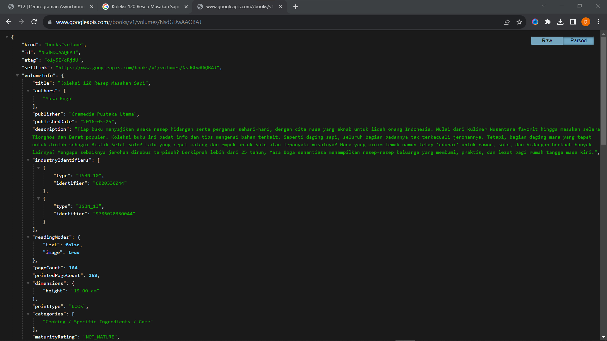
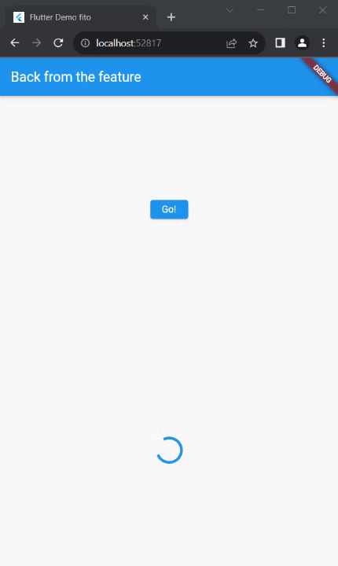

## Nama : Dhoriffito Diansyah Putra
## NIM : 2141720201
## Kelas : TI-3F

# Praktikum 1

## Soal 1

```dart
import 'package:flutter/material.dart';
import 'dart:async';
import 'package:http/http.dart';
import 'package:http/http.dart' as http;

void main() {
  runApp(const MyApp());
}

class MyApp extends StatelessWidget {
  const MyApp({super.key});

  @override
  Widget build(BuildContext context) {
    return MaterialApp(
      title: 'Flutter Demo fito',
      theme: ThemeData(
        primarySwatch: Colors.blue,
        visualDensity: VisualDensity.adaptivePlatformDensity,
      ),
      home: const FuturePage(),
    );
  }
}

class FuturePage extends StatefulWidget {
  const FuturePage({super.key, this.title = 'Future Page'});

  final String title;

  @override
  State<FuturePage> createState() => _FuturePageState();
}

class _FuturePageState extends State<FuturePage> {
  String result = '';

  @override
  Widget build(BuildContext context){
    return Scaffold(
      appBar: AppBar(
        title: const Text('Back from the feature'),
      ),

      body: Center(
        child: Column(
          children: [
            const Spacer(),
            ElevatedButton(
              onPressed: (){}, 
              child: const Text('Go!')
            ),
            const Spacer(),
            Text(result),
            const Spacer(),
            const CircularProgressIndicator(),
            const Spacer(),
          ],
        ),
      ),
    );
  }
}

```


## Soal 2




## Soal 3
* Substring : digunakan untuk mengambil sebagian string dari string awal
* CatchError : digunakan untuk menangani kesalahan yang terjadi pada sebuah promise


# Praktikum 2

## Soal 4

* Langkah 1: Mengambil data dari jaringan secara bersamaan menggunakan Future.wait()

```dart
 Future<int> returnOneAsync() async {
    await Future.delayed(const Duration(seconds: 3));
    return 1;
  }

  Future<int> returnTwoAsync() async {
    await Future.delayed(const Duration(seconds: 3));
    return 2;
  }

  Future<int> returnThreeAsync() async {
    await Future.delayed(const Duration(seconds: 3));
    return 3;
  }
```

* Langkah 2: Menghitung jumlah dari tiga fungsi asinkron `returnOneAsync()`, `returnTwoAsync()`, dan `returnThreeAsync()`. Fungsi ini menggunakan `await` untuk menunggu masing-masing fungsi asinkron selesai sebelum melanjutkan ke eksekusi kode berikutnya. 

```dart
  Future count() async {
    int total = 0;

    total = await returnOneAsync();
    total += await returnTwoAsync();
    total += await returnThreeAsync();

    setState(() {
      result = total.toString();
    });

  }
```



# Praktikum 3

## Soal 5

* Langkah 2: untuk membuat dan menyelesaikan Future secara asinkron

```dart
late Completer completer;

Future getNumber() {
  completer = Completer<int>();
  calculate();
  return completer.future;
}

Future calculate() async {
  await Future.delayed(const Duration(seconds : 5));
  completer.complete(42);
}
```


## Soal 6

* Jelaskan maksud perbedaan kode langkah 2 dengan langkah 5-6 tersebut!

Perbedaan untuk output masih sama saja, tetapi pada baris kode ditambahkan try and catch untuk menangani error yang terjadi pada kode tersebut.


## Soal 7


## Soal 8

Perbedaan langkah 1 dan langkah 4

* Langkah 1: Menggunakan `Future.delayed` untuk menunda eksekusi kode selama 5 detik
* Langkah 4: Menggunakan `Future.delayed` untuk menunda eksekusi kode selama 5 detik, tetapi menggunakan `async` dan `await` untuk menunggu eksekusi kode sebelumnya selesai

## Soal 9

