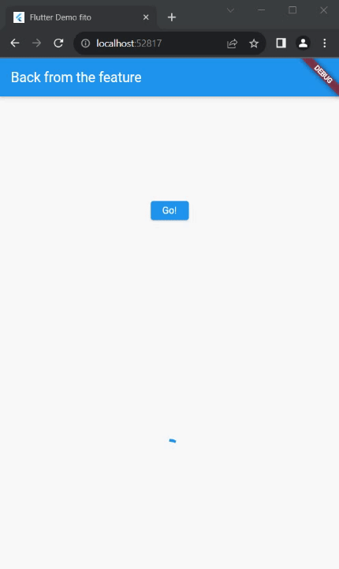

## Nama : Dhoriffito Diansyah Putra
## NIM : 2141720201
## Kelas : TI-3F

# Praktikum 1

## Soal 1

```dart
import 'package:flutter/material.dart';
import 'dart:async';
import 'package:http/http.dart';
import 'package:http/http.dart' as http;

void main() {
  runApp(const MyApp());
}

class MyApp extends StatelessWidget {
  const MyApp({super.key});

  @override
  Widget build(BuildContext context) {
    return MaterialApp(
      title: 'Flutter Demo fito',
      theme: ThemeData(
        primarySwatch: Colors.blue,
        visualDensity: VisualDensity.adaptivePlatformDensity,
      ),
      home: const FuturePage(),
    );
  }
}

class FuturePage extends StatefulWidget {
  const FuturePage({super.key, this.title = 'Future Page'});

  final String title;

  @override
  State<FuturePage> createState() => _FuturePageState();
}

class _FuturePageState extends State<FuturePage> {
  String result = '';

  @override
  Widget build(BuildContext context){
    return Scaffold(
      appBar: AppBar(
        title: const Text('Back from the feature'),
      ),

      body: Center(
        child: Column(
          children: [
            const Spacer(),
            ElevatedButton(
              onPressed: (){}, 
              child: const Text('Go!')
            ),
            const Spacer(),
            Text(result),
            const Spacer(),
            const CircularProgressIndicator(),
            const Spacer(),
          ],
        ),
      ),
    );
  }
}

```


## Soal 2


## Soal 3
* Substring : digunakan untuk mengambil sebagian string dari string awal
* CatchError : digunakan untuk menangani kesalahan yang terjadi pada sebuah promise

