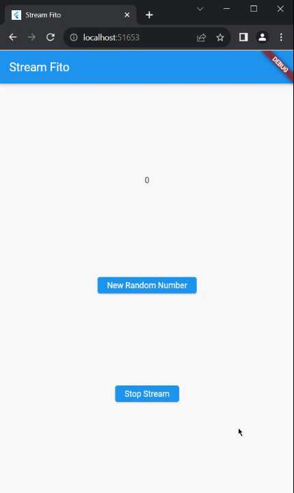
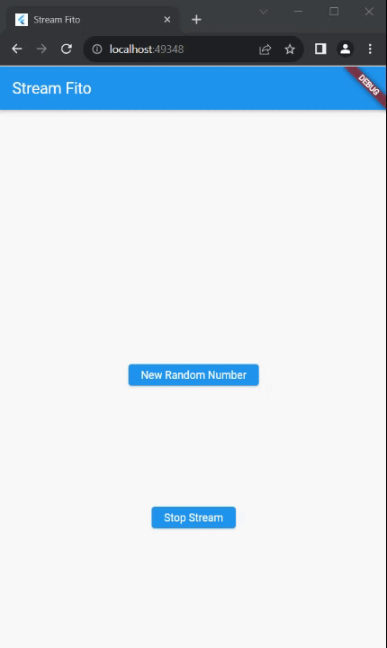
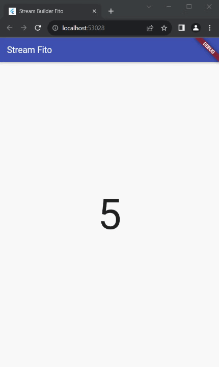
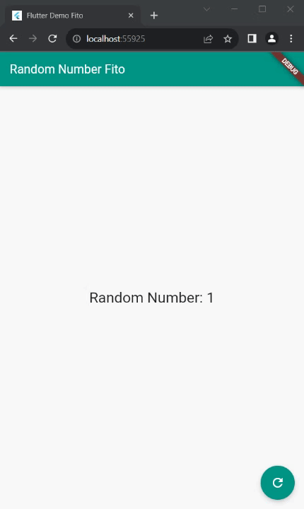

# Praktikum Week 13

## Soal 1

* Tambahkan nama panggilan Anda pada title app sebagai identitas hasil pekerjaan Anda.
```dart
title: 'Stream Fito',
```
* Gantilah warna tema aplikasi sesuai kesukaan Anda.
```dart
  theme: ThemeData(primarySwatch: Colors.blue),
```
* Lakukan commit hasil jawaban Soal 1 dengan pesan "W13: Jawaban Soal 1"

## Soal 2

* Tambahkan 5 warna lainnya sesuai keinginan Anda pada variabel colors tersebut.
```dart
class ColorStream {
  final List<Color> colors = [
    Colors.blueGrey,
    Colors.amber,
    Colors.deepPurple,
    Colors.lightBlue,
    Colors.teal,
    // Tambahkan 5 warna lainnya sesuai keinginan Anda pada variabel colors tersebut.
    Colors.pinkAccent,
    Colors.green,
    Colors.red,
    Colors.yellow,
    Colors.purple,
  ];
}
```
* Lakukan commit hasil jawaban Soal 2 dengan pesan "W13: Jawaban Soal 2"

## Soal 3

* Jelaskan fungsi keyword yield* pada kode tersebut!
untuk mendelegasikan atau melempar elemen-elemen dari satu stream ke dalam stream yang sedang dibuat. 
* Apa maksud isi perintah kode tersebut?
membuat asynchronous generator yang menghasilkan stream warna yang diperbarui setiap detik, diambil dari sebuah daftar colors. `Stream.periodic` digunakan untuk mengatur interval waktu, dan `yield*` untuk memasukkan nilai-nilai tersebut ke dalam stream.
* Lakukan commit hasil jawaban Soal 3 dengan pesan "W13: Jawaban Soal 3"

## Soal 4

* Capture hasil praktikum Anda berupa GIF dan lampirkan di README.

* Lakukan commit hasil jawaban Soal 4 dengan pesan "W13: Jawaban Soal 4"

## Soal 5

* Jelaskan perbedaan menggunakan listen dan await for (langkah 9) !
`listen` digunakan untuk mendapatkan data dari stream, sedangkan `await for` digunakan untuk mendapatkan data dari stream dan menunggu sampai stream tersebut selesai.
* Lakukan commit hasil jawaban Soal 5 dengan pesan "W13: Jawaban Soal 5"

## Soal 6

* Jelaskan maksud kode langkah 8 dan 10 tersebut!

langkah 8
Kode tersebut membuat instance dari NumberStream, mengambil controller-nya, dan kemudian membuat Stream dari controller tersebut. Selanjutnya, kode ini mendengarkan perubahan pada stream dan mengupdate lastNumber dalam fungsi setState ketika ada event baru.

langkah 10
Kode tersebut merupakan implementasi metode dispose dalam suatu widget atau kelas yang menggunakan numberStreamController. Pada saat objek/widget tersebut dihapus atau tidak lagi digunakan, dispose dipanggil untuk melakukan pembersihan. 
* Capture hasil praktikum Anda berupa GIF dan lampirkan di README.

* Lalu lakukan commit dengan pesan "W13: Jawaban Soal 6"

## Soal 7

* Jelaskan maksud kode langkah 13 sampai 15 tersebut!

langkah 13
```dart
 addError() {
  controller.sink.addError('error');
}
```
penjelasan : menambahkan pesan kesalahan 'error' ke dalam sink dari controller.

Langkah 14
```dart
.onError((error) {
    setState(() {
      lastNumber = -1;
    });
});
```

penjelasan: Ketika terjadi kesalahan dalam stream, nilai lastNumber diubah menjadi -1 dan diupdate menggunakan setState.

Langkah 15
```dart
 numberStream.addError();
```

penjelasan : Memanggil fungsi addError pada objek numberStream, menambahkan pesan kesalahan 'error' ke dalam stream.

* Kembalikan kode seperti semula pada Langkah 15, comment addError() agar Anda dapat melanjutkan ke praktikum 3 berikutnya.
* Lalu lakukan commit dengan pesan "W13: Jawaban Soal 7".

## Soal 8

* Jelaskan maksud kode langkah 1-3 tersebut!

Langkah 1
Mendeklarasikan variabel transformer dengan tipe StreamTransformer. Variabel ini akan digunakan untuk mengubah atau memanipulasi data yang mengalir melalui stream.

Langkah 2
Inisialisasi transformer dengan menggunakan StreamTransformer.fromHandlers. Ini adalah metode untuk membuat StreamTransformer yang mengubah data stream dengan menetapkan tiga fungsi berbeda

Langkah 3
Menggunakan transform untuk menerapkan transformer pada suatu stream. Kemudian, menggunakan listen untuk mendengarkan perubahan pada stream yang sudah diubah oleh transformer.

* Capture hasil praktikum Anda berupa GIF dan lampirkan di README.
* Lalu lakukan commit dengan pesan "W13: Jawaban Soal 8".

## Soal 9

* Jelaskan maksud kode langkah 2, 6 dan 8 tersebut!

langkah 2
mendengarkan perubahan pada suatu stream (stream). Ketika data baru masuk ke stream, fungsi dalam listen akan dijalankan, dan nilai yang masuk akan disimpan dalam variabel lastNumber setelah diupdate menggunakan setState

Langkah 6
Pada langkah ini, subscription dibatalkan. Ini berarti langganan tidak lagi akan mendengarkan atau menerima perubahan dari stream. 

Langkah 8
Pada langkah ini, sebuah angka acak (myNum) antara 0 dan 9 dihasilkan menggunakan Random. Selanjutnya, dilakukan pemeriksaan apakah numberStreamController (mungkin objek dari kelas yang mengontrol stream) masih terbuka (tidak ditutup).

* Capture hasil praktikum Anda berupa GIF dan lampirkan di README.

* Lalu lakukan commit dengan pesan "W13: Jawaban Soal 9".

## Soal 10

* Jelaskan mengapa error itu bisa terjadi ?4
Error bisa terjadi karena stream hanya bisa satu kali tidak bisa digunakan 2 stream dalam waktu yang bersamaan.
* Lakukan commit hasil jawaban Soal 10 dengan pesan "W13: Jawaban Soal 10"

## Soal 11

* Jelaskan mengapa hal itu bisa terjadi ?
Kerena menggunakan `Stream stream = numberStreamController.stream.asBroadcastStream();`, hal ini memungkinkan stream didengar oleh beberapa subscription, berbeda halnya dengan stream biasa.
* Capture hasil praktikum Anda berupa GIF dan lampirkan di README.

* Lalu lakukan commit dengan pesan "W13: Jawaban Soal 11".

## Soal 12

* Jelaskan maksud kode pada langkah 3 dan 7 !

Langkah 3
Kelas ini memiliki metode getNumber yang mengembalikan suatu stream `(Stream<int>)`. Stream ini akan menghasilkan nilai secara periodik setiap 1 detik menggunakan `Stream.periodic`. Setiap kali periode berlalu, fungsi yang didefinisikan oleh (int t) akan dipanggil, dan angka acak antara 0 dan 9 dihasilkan menggunakan Random. Nilai ini kemudian dikembalikan ke stream menggunakan `yield*`.

Langkah 7 
Kode tersebut implementasi penggunaan stream untuk menghasilkan nilai acak setiap detik dan membangun antarmuka pengguna yang memperbarui tampilan UI sesuai dengan nilai yang diterima dari stream.
* Capture hasil praktikum Anda berupa GIF dan lampirkan di README.

* Lalu lakukan commit dengan pesan "W13: Jawaban Soal 12".

## Soal 13

* Jelaskan maksud praktikum ini ! Dimanakah letak konsep pola BLoC-nya ?
Pada praktikum ini kita membuat aplikasi yang dapat mengubah warna secara acak setiap detiknya. Konsep pola BLoC-nya terletak pada penggunaan stream untuk menghasilkan nilai acak setiap detik dan membangun antarmuka pengguna yang memperbarui tampilan UI sesuai dengan nilai yang diterima dari stream.
* Capture hasil praktikum Anda berupa GIF dan lampirkan di README.

* Lalu lakukan commit dengan pesan "W13: Jawaban Soal 13".


