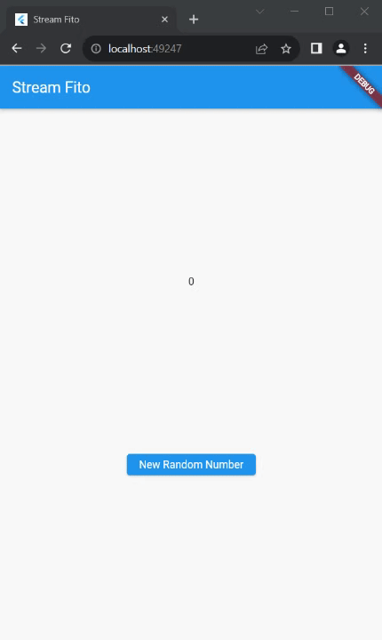

# Praktikum Week 13

## Soal 1

* Tambahkan nama panggilan Anda pada title app sebagai identitas hasil pekerjaan Anda.
```dart
title: 'Stream Fito',
```
* Gantilah warna tema aplikasi sesuai kesukaan Anda.
```dart
  theme: ThemeData(primarySwatch: Colors.blue),
```
* Lakukan commit hasil jawaban Soal 1 dengan pesan "W13: Jawaban Soal 1"

## Soal 2

* Tambahkan 5 warna lainnya sesuai keinginan Anda pada variabel colors tersebut.
```dart
class ColorStream {
  final List<Color> colors = [
    Colors.blueGrey,
    Colors.amber,
    Colors.deepPurple,
    Colors.lightBlue,
    Colors.teal,
    // Tambahkan 5 warna lainnya sesuai keinginan Anda pada variabel colors tersebut.
    Colors.pinkAccent,
    Colors.green,
    Colors.red,
    Colors.yellow,
    Colors.purple,
  ];
}
```
* Lakukan commit hasil jawaban Soal 2 dengan pesan "W13: Jawaban Soal 2"

## Soal 3

* Jelaskan fungsi keyword yield* pada kode tersebut!
untuk mendelegasikan atau melempar elemen-elemen dari satu stream ke dalam stream yang sedang dibuat. 
* Apa maksud isi perintah kode tersebut?
membuat asynchronous generator yang menghasilkan stream warna yang diperbarui setiap detik, diambil dari sebuah daftar colors. `Stream.periodic` digunakan untuk mengatur interval waktu, dan `yield*` untuk memasukkan nilai-nilai tersebut ke dalam stream.
* Lakukan commit hasil jawaban Soal 3 dengan pesan "W13: Jawaban Soal 3"

## Soal 4

* Capture hasil praktikum Anda berupa GIF dan lampirkan di README.

* Lakukan commit hasil jawaban Soal 4 dengan pesan "W13: Jawaban Soal 4"

## Soal 5

* Jelaskan perbedaan menggunakan listen dan await for (langkah 9) !
`listen` digunakan untuk mendapatkan data dari stream, sedangkan `await for` digunakan untuk mendapatkan data dari stream dan menunggu sampai stream tersebut selesai.
* Lakukan commit hasil jawaban Soal 5 dengan pesan "W13: Jawaban Soal 5"

## Soal 6

* Jelaskan maksud kode langkah 8 dan 10 tersebut!

langkah 8
Kode tersebut membuat instance dari NumberStream, mengambil controller-nya, dan kemudian membuat Stream dari controller tersebut. Selanjutnya, kode ini mendengarkan perubahan pada stream dan mengupdate lastNumber dalam fungsi setState ketika ada event baru.

langkah 10
Kode tersebut merupakan implementasi metode dispose dalam suatu widget atau kelas yang menggunakan numberStreamController. Pada saat objek/widget tersebut dihapus atau tidak lagi digunakan, dispose dipanggil untuk melakukan pembersihan. 
* Capture hasil praktikum Anda berupa GIF dan lampirkan di README.

* Lalu lakukan commit dengan pesan "W13: Jawaban Soal 6"

## Soal 7

* Jelaskan maksud kode langkah 13 sampai 15 tersebut!

langkah 13
```dart
 addError() {
  controller.sink.addError('error');
}
```
penjelasan : menambahkan pesan kesalahan 'error' ke dalam sink dari controller.

Langkah 14
```dart
.onError((error) {
    setState(() {
      lastNumber = -1;
    });
});
```

penjelasan: Ketika terjadi kesalahan dalam stream, nilai lastNumber diubah menjadi -1 dan diupdate menggunakan setState.

Langkah 15
```dart
 numberStream.addError();
```

penjelasan : Memanggil fungsi addError pada objek numberStream, menambahkan pesan kesalahan 'error' ke dalam stream.

* Kembalikan kode seperti semula pada Langkah 15, comment addError() agar Anda dapat melanjutkan ke praktikum 3 berikutnya.
* Lalu lakukan commit dengan pesan "W13: Jawaban Soal 7".
